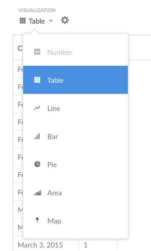

## Visualizing results
---
While tables are useful for looking up information or finding specific numbers, it's usually easier to see trends and make sense of data overall using charts.

In Metabase, an answer to a question can be visualized in a number of ways:

* Number
* Table
* Line
* Bar
* Pie
* Area
* Map

To change how the answer to your question is displayed, click on the Visualization dropdown menu beneath the question builder bar.

If a particular visualization doesn’t really make sense for your answer, the format option will appear faded in the dropdown menu.

Once a question is answered, you can save or download the answer, or add it to a dashboard.

### Visualization options

Each visualization type has its own advanced options you can tweak. Just click the gear icon next to the visualization selector. Here's an overview of what you can do:

#### Numbers
The options for numbers include adding prefixes or suffixes to your number (so you can do things like put a currency symbol in front or a percent at the end), setting the number of decimal places you want to include, and multiplying your result by a number (like if you want to multiply a decimal by 100 to make it look like a percent).

#### Tables
The table options allow you to hide and rearrange fields in the table you're looking at.

#### Line, bar, and area charts
These three charting types have very similar options, which are broken up into the following:
* **Data** — choose the fields you want to plot on your x and y axes. This also allows you to plot fields from unaggregated tables.
* **Display** — here's where you can make some cosmetic changes, like setting colors, and stacking bar or area charts.
* **Axes** — this is where you can hide axis markers or change their ranges.
* **Labels** — if you want to hide axis labels or customize them, here's where to go.

#### Pie charts
The options for pie charts let you choose which field to use as your measurement, and which one to use for the pie slices. You can also customize the pie chart's legend.

#### Maps
When you select the Map visualization setting, Metabase will automatically try and pick the best kind of map to use based on the table or result you're currently looking at. Here are the maps that Metabase uses:

* **United States Map** — Creating a map of the United States from your data requires your results to contain a column field with states. This lets you do things like visualize the count of your users broken out by state.
* **Country Map** — To visualize your results in the format of a map of the world broken out by country, your result must contain a field with countries.
* **Pin Map** — If your table contains a latitude and longitude field, Metabase will try to display it as a pin map of the world. This will put one pin on the map for each row in your table, based on the latitude and longitude fields. *Note: this map option requires a [Google Maps API key](https://developers.google.com/maps/documentation/javascript/get-api-key).*

When you open up the Map options, you can manually switch between a region map (i.e., United States or world) and a pin map. (And don't worry — a flexible way to add custom maps of other countries and regions will be coming soon.) If you're using a region map, you can also choose which field to use as the measurement, and which to use as the region (i.e. State or Country).

---

## Next: Sharing and organizing questions
Now let's learn about [sharing and organizing your saved questions](05-sharing-answers.md).
